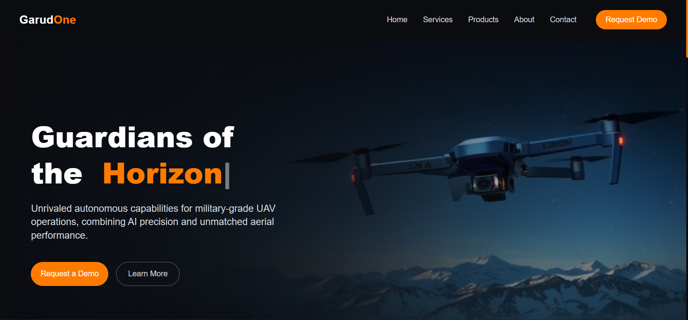
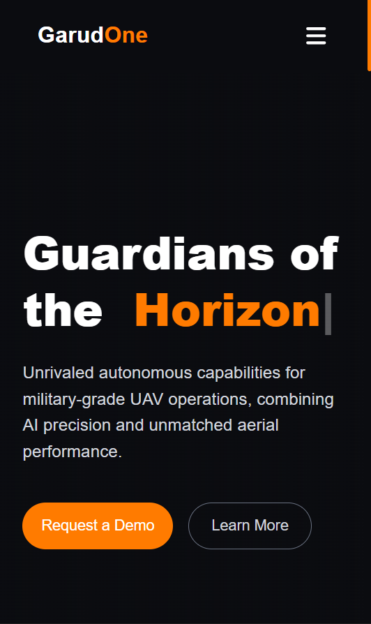

## 🚁Vyom Garud – Autonomous UAV Systems Website

A modern, fully responsive, animated UAV (Drone) technology website built using **React + Vite**, **TailwindCSS**, **Framer Motion**, and **Lenis smooth scroll**.  
Designed to showcase Vyom Garud’s autonomous capabilities, modular systems, product highlights, and technology overview.
---

## Preview
### Destop Preview


### Mobile Preview


---


## 🔴Live Demo
🔗 [View Live Project](https://vyom-garud-git-main-shubhams-projects-84579036.vercel.app?_vercel_share=2tBcNFFzvEcnpgArYwAMw8ta0Frjm2Zh)
---

## Features  
-  **Beautiful UI/UX** designed using TailwindCSS  
- **Smooth scrolling** with Lenis  
- **Scroll-triggered animations** with Framer Motion  
- **Reusable component architecture** 
- Fully **responsive** on all screen sizes  
- Modular **cards**, **sections**, and **layouts**  
- Dark theme with gradient overlays  
- Proper folder structure for scalable development 
---


## Technologies Used

| Technology | Purpose |
|----------|----------|
| **React + Vite** | Frontend framework |
| **TailwindCSS** | Styling & responsive design |
| **Framer Motion** | Animations |
| **Typewriter-effect** | Typing animation |
| **React Icons** |Icons for components |

---

## UI/UX Overview
### *1. Visual Style*
I used a dark theme with orange accents to match the UAV/defense feel of the project.  
The fonts are modern and clean so the text looks sharp and easy to read.

### *2. Layout & Sections*
The website is divided into clear sections like **Hero, Services, Products, About, and Contact**.  
Each section has enough spacing so it doesn’t feel cluttered, and I tried to keep the layout simple and easy to follow.

### *3. Animations*
I added smooth scrolling using **Lenis** and fade-in animations with **Framer Motion** so the sections appear smoothly when scrolling.  
The hero heading also includes a **typewriter effect** to make it feel more dynamic.

### *4. Responsive Design*
I made sure the UI works well on mobile screens by including:

- A mobile-friendly hamburger menu  
- A separate background image for smaller devices  
- Responsive grids for the cards  

This keeps the design usable across different screen sizes.

### *5. Reusable Components*
I created reusable components like **cards, buttons, and section wrappers** to keep the code cleaner and easier to manage as the project grows.

---

---
## Setup

1. Clone the repository:
  ```bash
   git clone https://github.com/shubham-kumar012/vyom-garud.git
   cd vyom-garud
  ```

2. Install dependencies
```bash
   npm install
  ```

3. Start the development server
```bash
npm run dev
```
- The app will run locally at - http://localhost:5173 (if using Vite)
--- 


---


## Author🙋‍♂️
**Name:**  Shubham Kumar

**Email:** shubhampal7083@gmail.com

**Github:** [shubham-kumar012](https://github.com/shubham-kumar012)

**LinkedIn:** [Shubham Kumar](https://linkedin.com/in/shubham-kumar-111041267)


